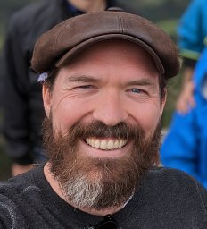
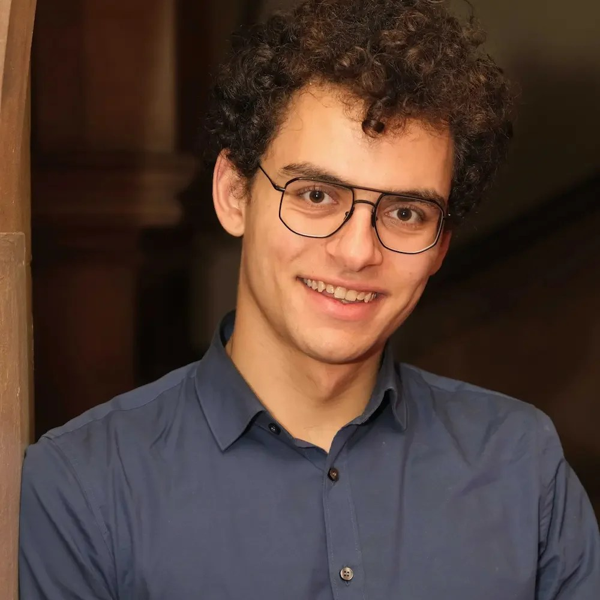
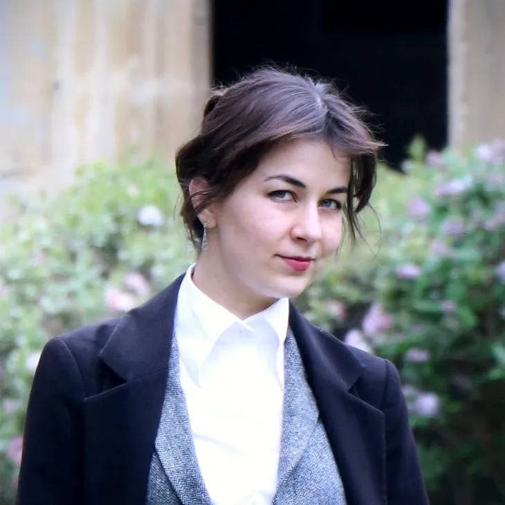
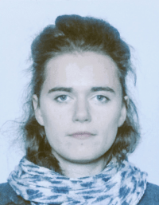
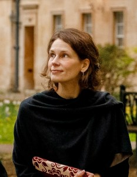
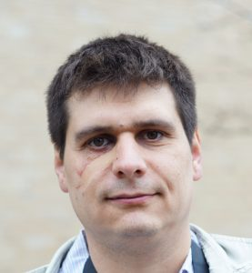
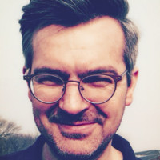

::: {.page-shell}

::: {.team-grid}

::: {.team-card}
{fig-alt="Doug Leasure"}

::: {.team-body}
### Doug Leasure, PhD

::: {.team-role}
Director & Research Data Scientist
:::

::: {.team-bio}
**Director of Real Good Research.** Senior Researcher and Data Scientist for the Leverhulme Centre for Demographic Science at the University of Oxford. Interested in near real-time population nowcasting methods, particularly Bayesian statistics, using a combination of digital trace data, satellite remote sensing, and survey data.
:::
:::
:::

::: {.team-card}
{fig-alt="Karim Alaa El-Din"}

::: {.team-body}
### Karim Alaa El-Din, MSci

::: {.team-role}
Computer Vision Engineer
:::
::: {.team-bio}
**Director of Eden Technology Limited.** Karim is currently working on his PhD in computational quantum physics at the University of Oxford and contributes satellite image analysis for tent identification and population estimation.
:::
:::
:::

::: {.team-card}
{fig-alt="Jessica Rapson"}

::: {.team-body}
### Jessica Rapson

::: {.team-role}
Machine Learning & Public Policy Researcher
:::

::: {.team-bio}
**Executive Director of the [Algorithmic Governance Foundation](https://algorithmicgovernance.org){.bold-link target="_blank" rel="noopener noreferrer"}**. Jessica is a machine learning researcher at the University of Oxford with a background in both machine learning and public policy, focusing on applications of AI and automations for public-serving organisations.
:::
:::
:::

::: {.team-card}
{fig-alt="Edith Darin"}

::: {.team-body}
### Edith Darin, MSc

::: {.team-role}
Population Data Scientist
:::
::: {.team-bio}
**Doctoral researcher at the [Leverhulme Centre for Demographic Science, University of Oxford](https://demography.ox.ac.uk){.bold-link target="_blank" rel="noopener noreferrer"}** developing statistical modelling approaches to estimate forced population displacement and to fill gaps in incomplete censuses using administrative registers, mobile phone data, social media, and satellite imagery.
:::
:::
:::

::: {.team-card}
{fig-alt="Claire Dooley"}

::: {.team-body}
### Claire Dooley, DPhil

::: {.team-role}
Applied Researcher in Survey Methods and Spatial Analysis
:::
::: {.team-bio}
**Lecturer in Spatial Data Science from the [Centre for Advanced Spatial Analysis at University College London](https://www.ucl.ac.uk/bartlett/casa){.bold-link target="_blank" rel="noopener noreferrer"}.** Specialising in geocomputing methods for bespoke survey sampling frames and spatial analysis to better understand the needs of marginalised and vulnerable populations.
:::
:::
:::

::: {.team-card}
{fig-alt="Maksym Bondarenko"}

::: {.team-body}
### Maksym Bondarenko, PhD

::: {.team-role}
Spatial Data Engineer and Software/Web Developer
:::
::: {.team-bio}
**Leader of the Spatial Data Infrastructure Team for [WorldPop at the University of Southampton](https://worldpop.org){.bold-link target="_blank" rel="noopener noreferrer"}**. Focused on computational architecture for high-resolution population datasets and the development of interactive data dashboards and data repositories.
:::
:::
:::

::: {.team-card}
{fig-alt="Gianluca Boo"}

::: {.team-body}
### Gianluca Boo, PhD

::: {.team-role}
Data Scientist and Graphical Designer
:::
::: {.team-bio}
**Quantitative Research Leader at [RAND Europe](https://www.rand.org/randeurope.html){.bold-link target="_blank" rel="noopener noreferrer"}** with a background in end-to-end data science, bespoke datasets, advanced visualisation, demography, epidemiology, forensics, and urban planning.
:::
:::
:::

::: {.team-card}
{fig-alt="David Kerr"}

::: {.team-body}
### David Kerr, MSc

::: {.team-role}
Database Engineer and Back-end Web Developer
:::
::: {.team-bio}
Senior Back-end Engineer at [MapMortar](https://www.mapmortar.io/){.bold-link target="_blank" rel="noopener noreferrer"} and Director of [GISRede](https://gisrede.com){.bold-link target="_blank" rel="noopener noreferrer"}. Previously worked as a geospatial data scientist on WorldPop’s Spatial Data Infrastructure team and contributes innovative data dashboards and GIS insights for academic research.
:::
:::
:::
:::
:::
