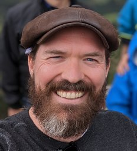
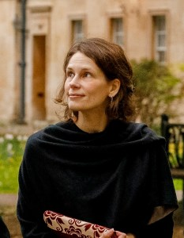
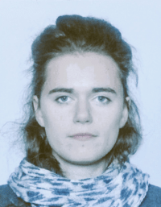
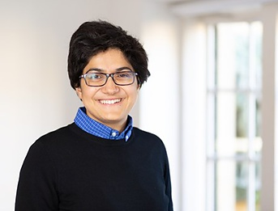
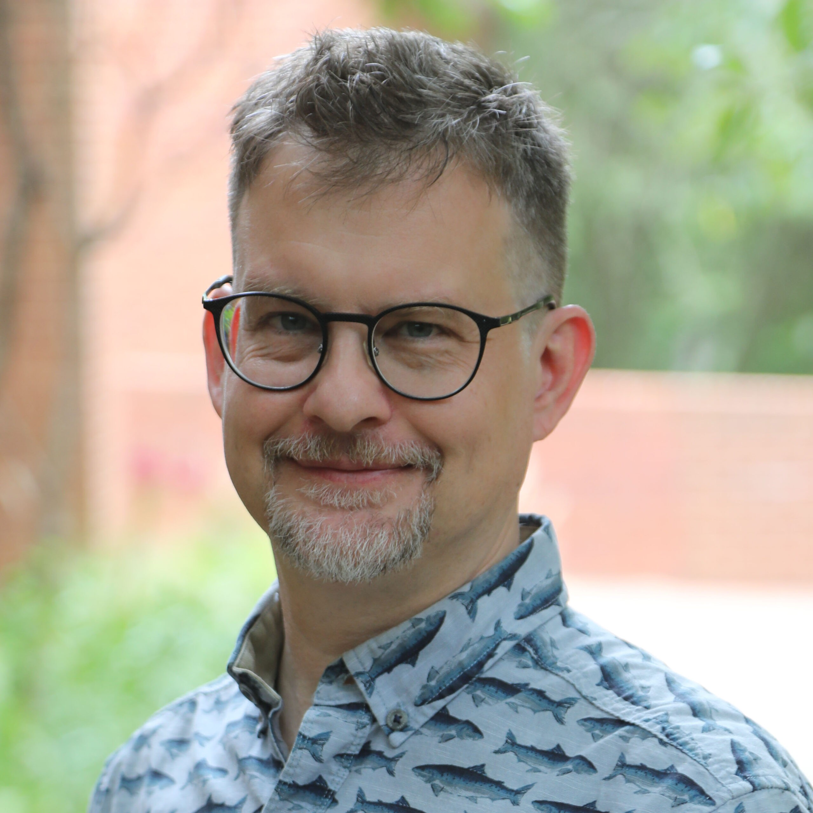
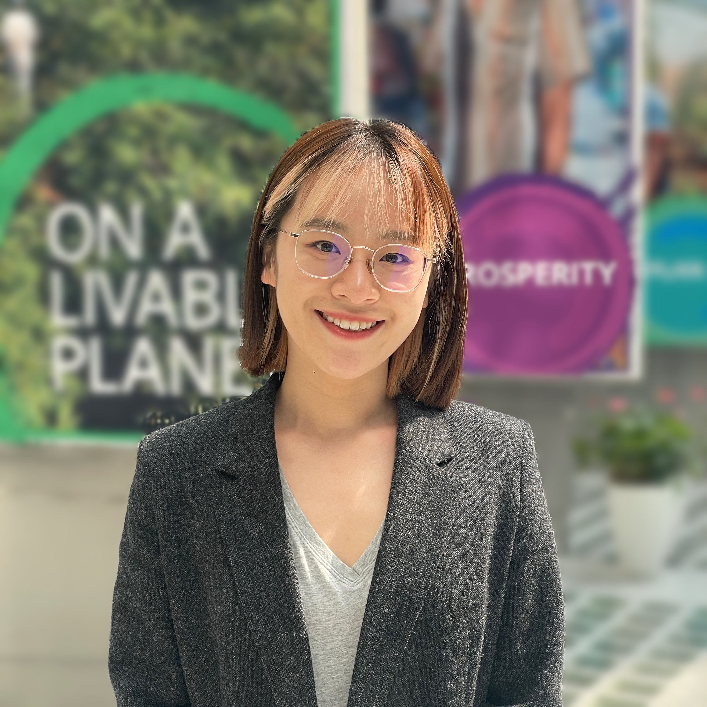
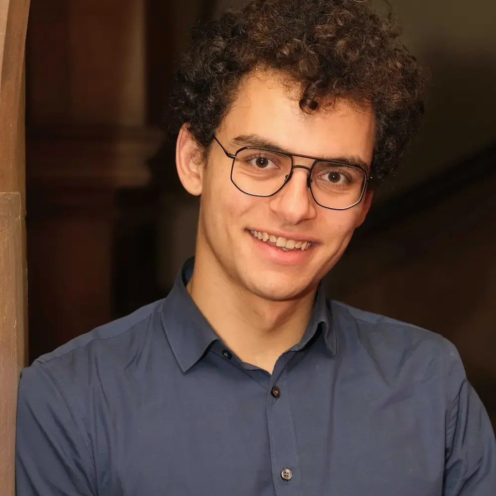
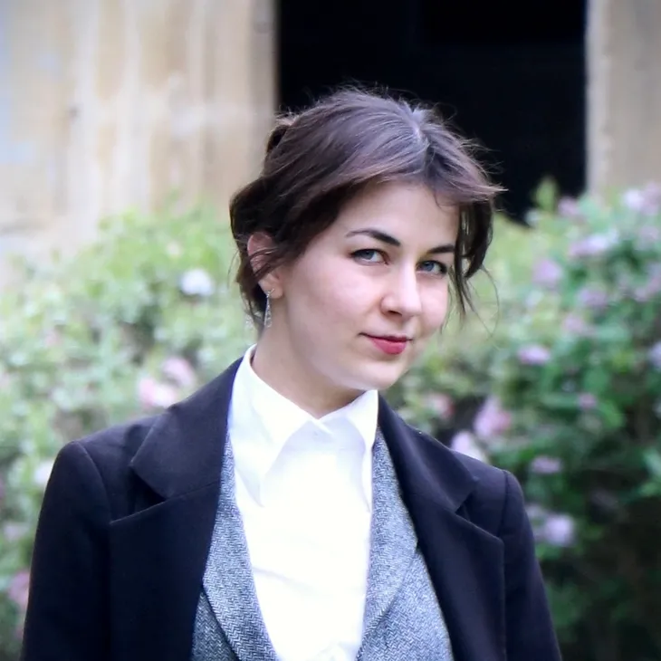
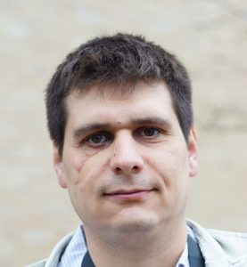
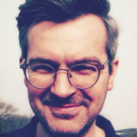

::: {.page-shell}

## Board of Directors

::: {.team-grid}

<!-- Doug --->

::: {.team-card}
{fig-alt="Doug Leasure"}

::: {.team-body}
### Doug Leasure, PhD

::: {.team-role}
Executive Director & Research Data Scientist
:::

::: {.team-bio}
Founding Director of Real Good Research. Develops population nowcasting methods to support humanitarian response, sustainable development, and conservation. Previously at [Oxford’s Leverhulme Centre for Demographic Science](https://demography.ox.ac.uk){.bold-link target="_blank" rel="noopener noreferrer"}, [WorldPop](https://worldpop.org){.bold-link target="_blank" rel="noopener noreferrer"}, and the [River Basin Center](https://rivercenter.uga.org){.bold-link target="_blank" rel="noopener noreferrer"}.
:::
:::
:::

<!-- Claire --->

::: {.team-card}
{fig-alt="Claire Dooley"}

::: {.team-body}
### Claire Dooley, DPhil

::: {.team-role}
Director & Applied Researcher in Survey Methods and Spatial Analysis
:::
::: {.team-bio}
Lecturer in Spatial Data Science at [UCL’s Centre for Advanced Spatial Analysis](https://www.ucl.ac.uk/bartlett/casa){.bold-link target="_blank" rel="noopener noreferrer"}. Uses survey methods and spatial analysis to understand the needs of marginalised populations.
:::
:::
:::

<!-- Edith --->

::: {.team-card}
{fig-alt="Edith Darin"}

::: {.team-body}
### Edith Darin, DPhil

::: {.team-role}
Director & Population Data Scientist
:::
::: {.team-bio}
Researcher at [Oxford’s Leverhulme Centre for Demographic Science](https://demography.ox.ac.uk){.bold-link target="_blank" rel="noopener noreferrer"}. Develops statistical methods to estimate forced displacement and fill gaps in population censuses.
:::
:::
:::

<!-- Ridhi --->

::: {.team-card}
{fig-alt="Ridhi Kashyap"}

::: {.team-body}
### Prof. Ridhi Kashyap

::: {.team-role}
Director & Computational Social Scientist
:::
::: {.team-bio}
Professor of Demography and Computational Social Science at Oxford. Studies population dynamics, human development, and gender inequality.
:::
:::
:::

<!-- Seth --->

::: {.team-card}
{fig-alt="Seth Wenger"}

::: {.team-body}
### Prof. Seth Wenger

::: {.team-role}
Director & Applied Freshwater Ecologist
:::
::: {.team-bio}
Professor at [UGA’s Odum School of Ecology](https://ecology.uga.edu/){.bold-link target="_blank" rel="noopener noreferrer"} and Director of Science at its [River Basin Center](https://rivercenter.uga.edu){.bold-link target="_blank" rel="noopener noreferrer"}. Connects freshwater research with natural resource management and conservation policy.
:::
:::
:::

:::

## Collaborating Researchers {.team-collaborators-heading}

::: {.team-grid}

<!-- Wenlan --->

::: {.team-card}
{fig-alt="Wenlan Zhang, MSc"}

::: {.team-body}
### Wenlan Zhang, MSc

::: {.team-role}
Geospatial Data Scientist
:::
::: {.team-bio}
Doctoral researcher at [UCL’s Centre for Advanced Spatial Analysis](https://www.ucl.ac.uk/bartlett/casa){.bold-link target="_blank" rel="noopener noreferrer"}. Uses geospatial methods and machine learning to study urban populations and inequalities.
:::
:::
:::

<!-- Karim --->

::: {.team-card}
{fig-alt="Karim Alaa El-Din"}

::: {.team-body}
### Karim Alaa El-Din, MSci

::: {.team-role}
Computer Vision Engineer
:::
::: {.team-bio}
Director of Eden Technology Limited and PhD researcher at Oxford. Contributes satellite image analysis for tent identification and population estimation.
:::
:::
:::

<!-- Jess --->

::: {.team-card}
{fig-alt="Jessica Rapson"}

::: {.team-body}
### Jessica Rapson

::: {.team-role}
Machine Learning & Public Policy Researcher
:::

::: {.team-bio}
Executive Director of the [Algorithmic Governance Foundation](https://algorithmicgovernance.org){.bold-link target="_blank" rel="noopener noreferrer"}. Works at the intersection of machine learning and public policy.
:::
:::
:::

<!-- Maksym --->

::: {.team-card}
{fig-alt="Maksym Bondarenko"}

::: {.team-body}
### Maksym Bondarenko, PhD

::: {.team-role}
Spatial Data Engineer and Software/Web Developer
:::
::: {.team-bio}
Leads the Spatial Data Infrastructure Team at [WorldPop, University of Southampton](https://worldpop.org){.bold-link target="_blank" rel="noopener noreferrer"}. Builds computational systems for population datasets, dashboards, and data repositories.
:::
:::
:::

<!-- Gianluca --->

::: {.team-card}
{fig-alt="Gianluca Boo"}

::: {.team-body}
### Gianluca Boo, PhD

::: {.team-role}
Data Scientist and Graphical Designer
:::
::: {.team-bio}
Quantitative Research Leader at [RAND Europe](https://www.rand.org/randeurope.html){.bold-link target="_blank" rel="noopener noreferrer"}. Brings expertise in data science, visualisation, demography, and urban planning.
:::
:::
:::

<!-- David --->

::: {.team-card}
{fig-alt="David Kerr"}

::: {.team-body}
### David Kerr, MSc

::: {.team-role}
Database Engineer and Back-end Web Developer
:::
::: {.team-bio}
Senior Back-end Engineer at [MapMortar](https://www.mapmortar.io/){.bold-link target="_blank" rel="noopener noreferrer"} and Director of [GISRede](https://gisrede.com){.bold-link target="_blank" rel="noopener noreferrer"}. Contributes data dashboards and GIS insights for academic research.
:::
:::
:::
:::
:::

::: {.team-contact}
## Interested in working with us?

Reach out with ideas and opportunities to do good things for people and the planet.

[Get in touch →](contact.qmd)
:::
