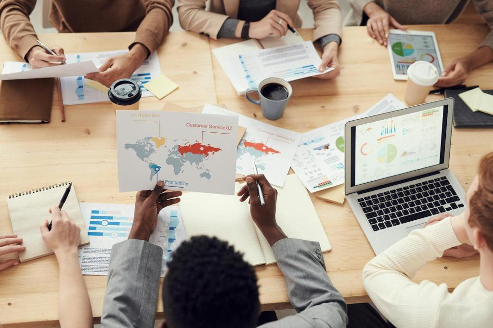
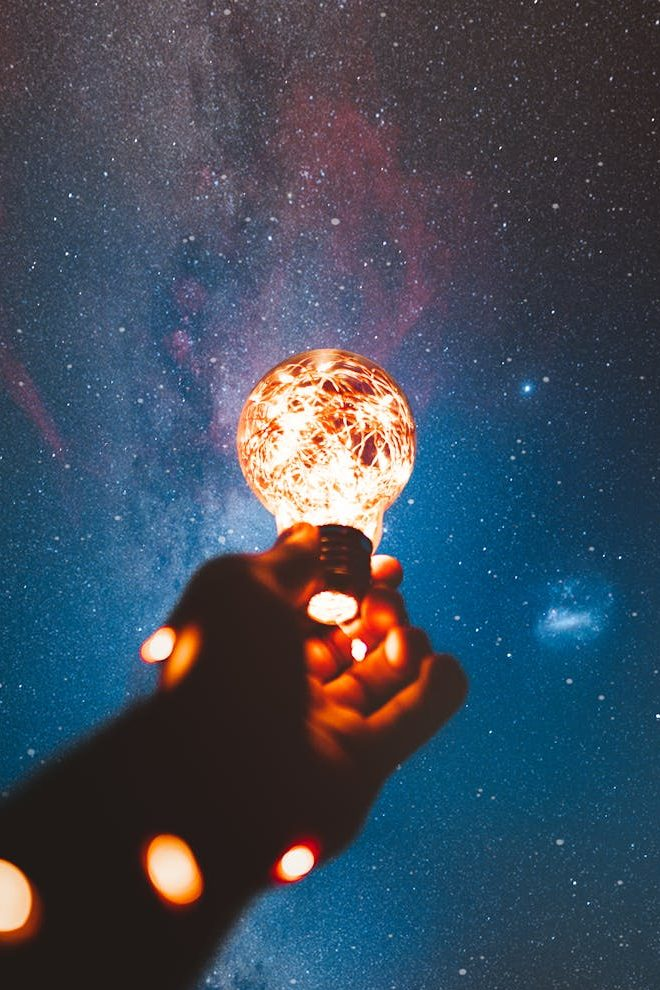
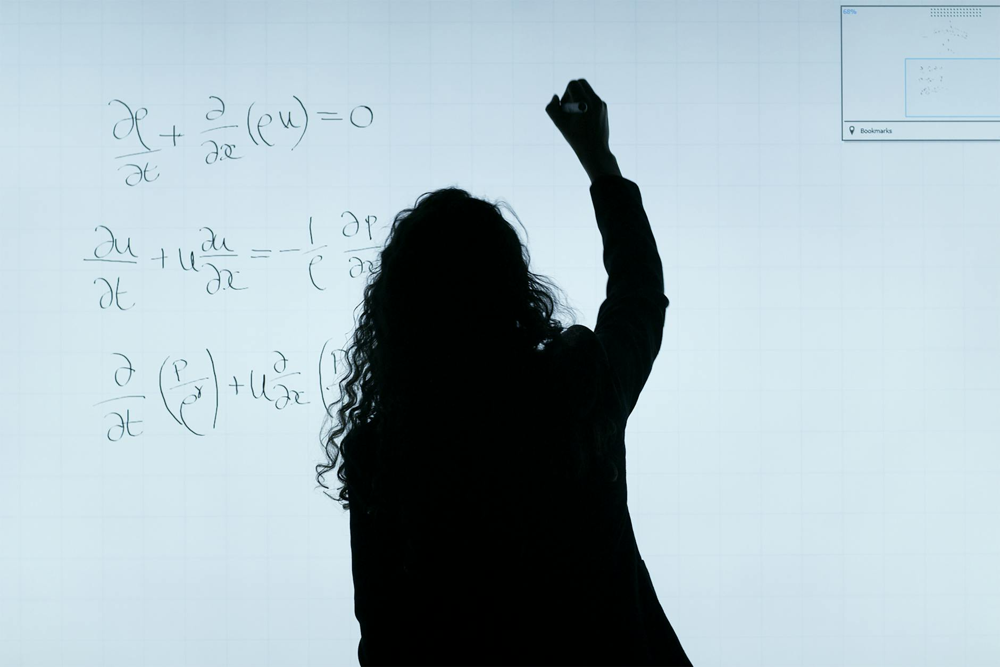

  
  

Real Good Research

Doing <strong>real good</strong> in the world through innovative <strong>research</strong>.

  

::: {.home-band .home-band-plain}
::: {.home-split}
::: {.home-image}
{fig-alt="People leaning over a table"}
:::

::: {.home-copy}
## Our mission

At **Real Good Research**, our passion is using science for problem solving to do good things for people and the planet.

We focus on **population estimation in data scarce contexts** because this provides critical information needed for sustainable development, environmental conservation, and humanitarian response.
:::
:::
:::

::: {.home-band .home-band-blue}
::: {.home-split .home-split-reverse}
::: {.home-copy}
## Innovation

**Science is at the core** of everything we do, from developing new ways to use innovative data to evaluating the weight of evidence that guides decision-making.

We prototype experimental solutions quickly and iterate methodically towards better solutions for our partners.

Our open science practices help build trust in new methods and allow community collaboration to make improvements.
:::

::: {.home-image .home-image-portrait}
{fig-alt="Person holding a light bulb"}
:::
:::
:::

::: {.home-band .home-band-cream}
::: {.home-split}
::: {.home-image .home-image-portrait}
{fig-alt="Woman holding a puzzle piece"}
:::

::: {.home-copy}
## Geeks in action

Real good researchers put science into action for **humanitarian response** and **sustainable development**.

We partner with the United Nations and NGOs to find the right challenges and to deliver results that matter.
:::
:::
:::

::: {.home-band .home-band-grey}
::: {.home-split .home-split-reverse}
::: {.home-copy}
## Sharing our secrets

The Real Good Research team wants to **teach you how to do what we do**. Then, you take over and we move on to the next challenge.

Through our open science, capacity strengthening workshops, and academic teaching, we want to empower the global community of real good researchers to work on solving big important challenges together.
:::

::: {.home-image}
{fig-alt="Woman writing on a whiteboard"}
:::
:::
:::

::: {.home-contact}
## Contact us

Please [Contact Us](contact.qmd) to reach out with ideas and opportunities to do good things.

Find our code and collaborate with us on GitHub at [realgoodresearch](https://github.com/realgoodresearch).
:::
:::
