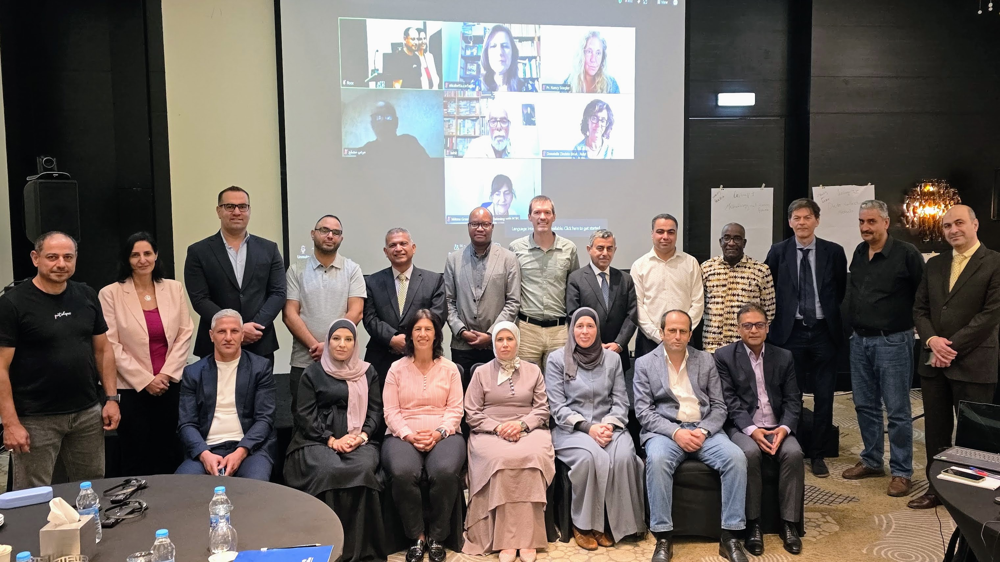
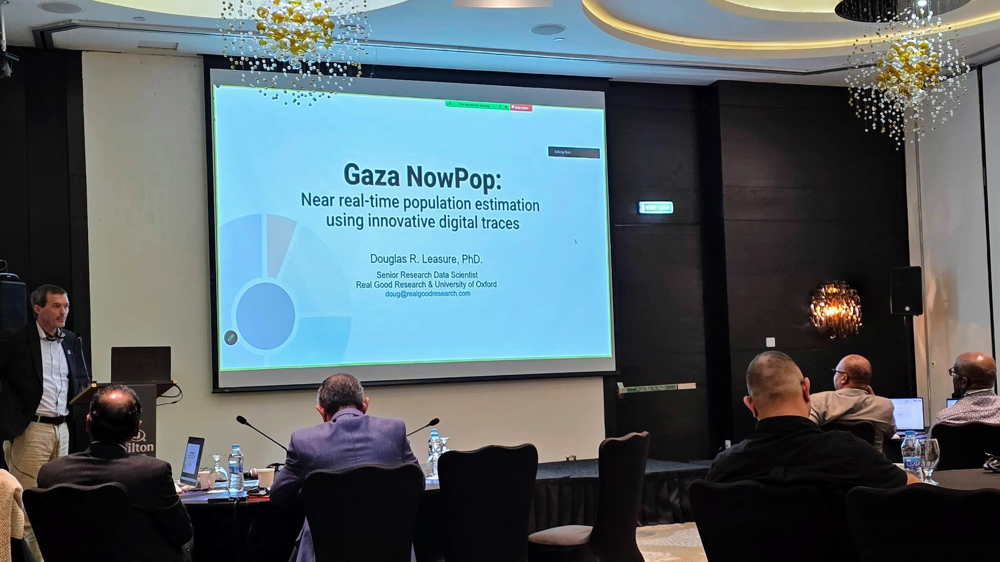
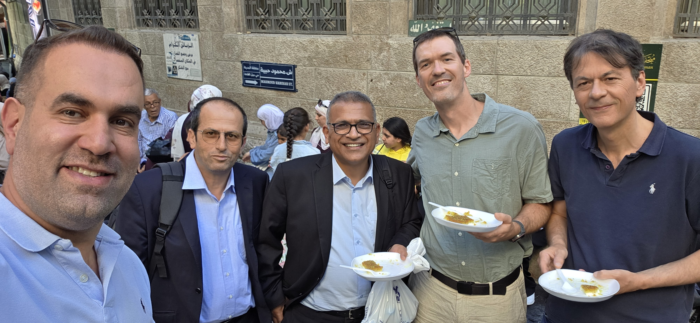

**Amman, Jordan, 1 July 2026** - Real Good Research joined the Palestinian Central Bureau of Statistics (PCBS) and the United Nations Population Fund (UNFPA) in Amman from 29 June to 1 July 2026 for a technical expert consultative workshop to begin planning for the 2027 Palestine Population and Housing Census.

The workshop brought together statisticians, demographers, geospatial researchers, census specialists, and humanitarian data experts to assess the feasibility, methodology, and operational roadmap for a census in a context shaped by conflict, displacement, damage to infrastructure, and rapidly changing population patterns.

The discussions highlighted the scale of the technical challenge facing the census process. Participants reviewed lessons from the 2017 census, the complexity of household listing, and the implications of large-scale displacement and physical destruction for data collection, coverage, and field operations.

A central theme of the workshop was the need to combine international census standards with approaches that are realistic in complex and dynamic settings. PCBS, UNFPA, ESCWA, and other experts discussed hybrid and mixed-method census designs, the role of geospatial tools, and the potential contribution of administrative data and new technologies.

Real Good Research's contribution to the workshop built on its Gaza NowPop Project, which provides operational population estimates to UNOCHA and the wider humanitarian response. The project combines innovative data sources and methods, including social media signals, polio vaccination data, telecommunications data, and a bespoke satellite-based tent mapping machine learning algorithm, to help estimate where displaced populations are located and how their distribution is changing.

The workshop also examined available national data sources including rich administrative records, humanitarian population estimates and needs assessment surveys, and the nowcasting approaches used in Gaza NowPop to help address gaps where direct enumeration is difficult. Participants discussed how different data streams might be brought together while remaining clear about the strengths and limitations of each source.

There was also substantial discussion of census content and scope, including what can realistically be collected, how the census can support national planning and humanitarian recovery, and how basic concepts such as household and enumeration unit should be defined in tent encampments and other temporary or fluid living arrangements.

Real Good Research remains committed to supporting PCBS, UNFPA, and other partners as the 2027 census roadmap takes shape. This workshop marked an important first step in the technical planning process and a valuable opportunity to align census design with the realities of population change, displacement, and humanitarian response.
