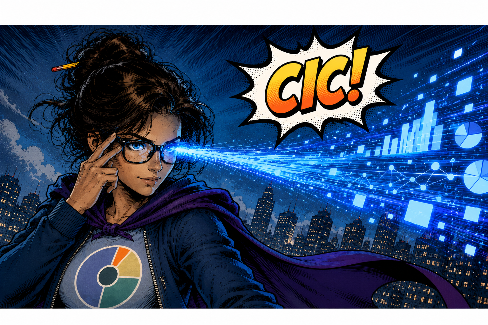

Our aim has always been to pursue innovations that benefit people and the planet. We are excited to announce that we recently transformed Real Good Research into a Community Interest Company that is strictly non-profit. We feel that this organisational structure and governance model better reflects our values and community-driven mission. I wanted to write this article to tell you a little bit about what this means for us and why we're excited about it. 

**Community.** A Community Interest Company must work to benefit their community. We have defined our community as people globally who benefit from progress towards the United Nations Sustainable Development Goals. This includes communities affected by natural disasters and armed conflict. It includes communities affected by social and economic inequalities. It includes communities that would benefit from environmental conservation and restoration. It includes communities that are underrepresented in official population statistics, and therefore may be excluded from adequate government services and representation in government. We see a bunch of opportunities to leverage innovative digital data, bespoke analytical methods, and educational outreach to benefit these communities through our existing partnerships with the United Nations, NGOs, governments, academics, and the private sector. We have now formalised this mission through our organisational structure.

**Profits.** As a not-for-profit (called Limited by Guarantee in the UK), we are no longer allowed to attract investor funds by selling shares in the company and paying dividends to those investors when we earn a surplus. Not that we ever did this anyways. 100% of funds that go into the organisation must be invested in our mission. If we make a big surplus, then we are required to reinvest that surplus to do good things for people and the planet. This is something that really excites us and that we already wanted to do. Our new structure makes this a legal requirement to protect potential funders. 

**Funding.** As a non-profit CIC, we are now better positioned to compete for grants to fund our general mission while also pursuing contracts to fund specific services that we provide to our partners. Given the nature of our mission, many of the partners that we want to support cannot pay for services. We want to provide services to them anyways, and this new structure will help us do that. 

**Governance.** Our new governance model means that each director has an equal vote in governance decisions. Nobody can buy their way to more power within the organisation. This definitely reflects our values of promoting equality, not to mention humility. I want to sincerely thank our founding co-directors, Claire Dooley and Edith Darin, who have stepped in with optimism and energy (... and bravery) to join me in developing a fair and effective governance model to keep our operations on track. We hope to expand the board as we grow into our new structure to bring a diversity of perspectives together to guide our decision-making.

**Going forward.** A lot of work remains to bring the new organisational structure into full operation. We want to expand the board of directors, and we also plan to appoint an external advisory board to help make sure we are serving our community well. While we work on this, we will continue to grow our network of academic researchers and students from across institutions with our friends in global NGOs and the United Nations to solve big challenges through innovation.  
