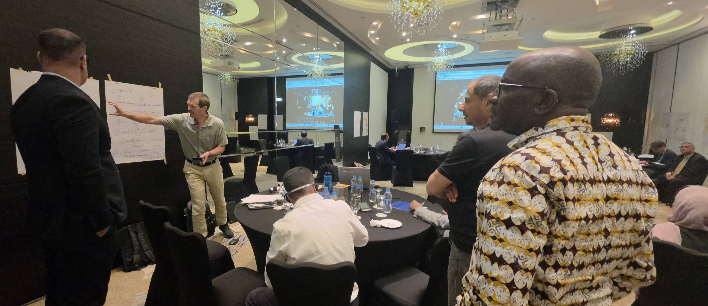
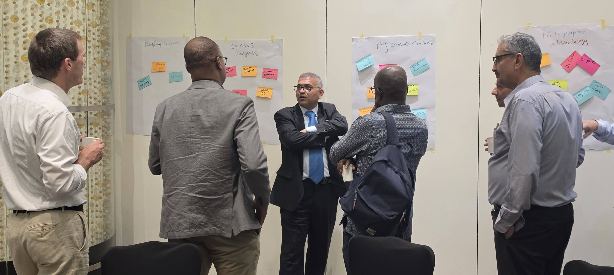

From 29 June to 1 July 2026, I travelled to Amman, Jordan, to take part in a technical expert consultative workshop with the Palestinian Central Bureau of Statistics (PCBS) and the United Nations Population Fund (UNFPA). The purpose of the meeting was straightforward but ambitious: to begin the technical planning for the next Palestine Population and Housing Census, scheduled for 2027.

The workshop brought together statisticians, demographers, geospatial researchers, census specialists, and humanitarian data experts to discuss the feasibility, methodology, and roadmap for a census in a context shaped by conflict, displacement, damage to infrastructure, and rapidly changing population patterns. It was a sobering and deeply practical set of discussions, and an important reminder that good population statistics depend on both technical rigor and an honest reading of the conditions on the ground.

For me, the workshop also connected directly to the humanitarian population nowcasting work we have been doing through the Gaza NowPop Project. That work supports operational population estimates for UNOCHA and the wider humanitarian response, combining multiple innovative data sources and methods to help answer one of the most urgent questions in the response: where are people now, and how is that changing?

The first day focused on what the agenda called "the reality on the ground." We heard from PCBS colleagues about the challenges of data collection in Palestine, the lessons learned from the 2017 census, the complexity of household listing, and the operational consequences of large-scale displacement and physical destruction. Those conversations set the tone for the whole meeting: any future census design will need to be realistic about access, safety, coverage, and the limits of conventional enumeration methods.

We also spent time looking outward, comparing Palestine's census planning with international and regional experience. UNFPA and ESCWA colleagues shared examples of hybrid and mixed-method censuses, as well as approaches used in other complex settings. The central question was not whether international standards matter, but how they can be applied responsibly in a context where some areas are inaccessible, some populations are displaced, and the administrative landscape is incomplete.

That led naturally to a discussion of geospatial tools, administrative data, and new technologies. Satellite imagery, machine learning, administrative registers, social media signals, telecommunications data, and multi-mode data collection all have roles to play, but only if they are tied to a clear operational framework. One of the most important themes throughout the workshop was the need to define basic census concepts carefully in places where ordinary assumptions do not hold: what counts as a household, how enumeration units should be defined in tent encampments or other temporary shelters, and how a census can remain valid if people are displaced again during implementation.

The second day shifted toward the data environment. We reviewed available national data sources, administrative records, humanitarian population estimates, and the nowcasting approaches we use in Gaza NowPop to help fill gaps where direct enumeration is difficult. For me, one of the most useful parts of the meeting was hearing how these different streams of information might be brought together without losing clarity about what each source can and cannot do.

There was also a strong emphasis on census content and scope: what should be collected, what can realistically be collected, and how the census can serve both national planning and humanitarian recovery. Those are not abstract questions. In a setting where needs are urgent and resources are constrained, the value of the census lies in producing information that is trustworthy, usable, and respectful of the risks facing both respondents and field staff.

One of the most encouraging parts of the workshop was the spirit of collaboration in the room. The technical discussion was rigorous, but it was also grounded in a shared sense of purpose. Planning for a census in Palestine is not just a statistical exercise; it is part of building the evidence base needed to understand population change, support planning, and ensure that communities are visible in the official record.

For us at Real Good Research, being part of this process is both an honour and a responsibility. Through Gaza NowPop, we have been contributing operational population estimates to UNOCHA and humanitarian partners using a combination of social media, polio vaccination, telecommunications, and satellite-based tent mapping methods. We are committed to supporting the technical work ahead alongside PCBS, UNFPA, and other partners as the 2027 census roadmap takes shape. There is a lot still to do, but the Amman workshop was an important first step.
