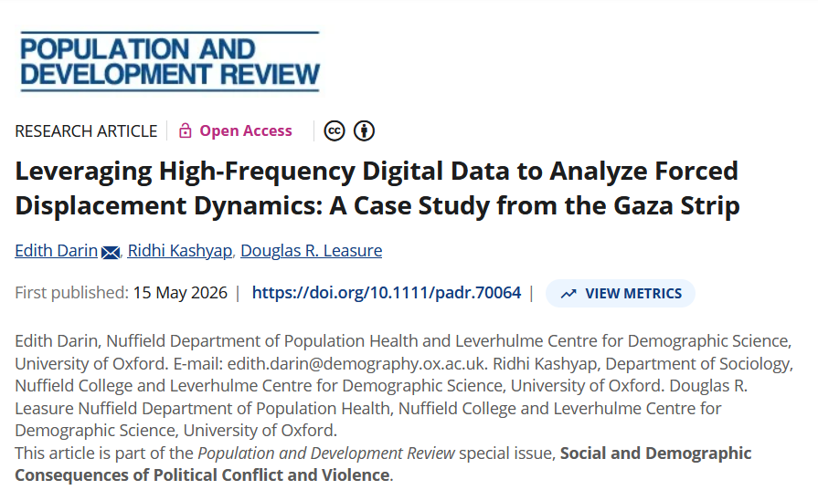
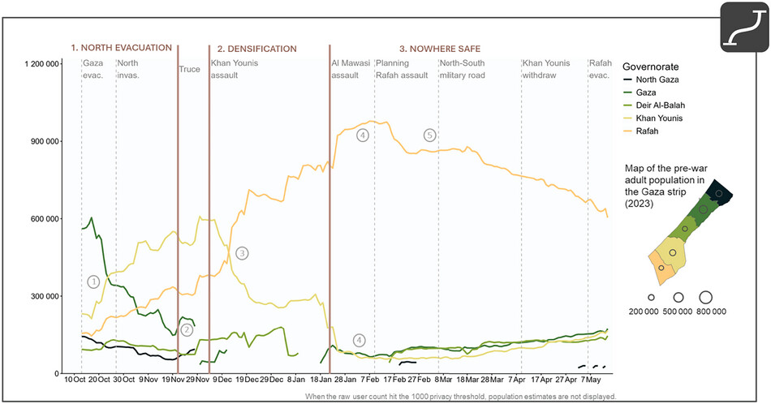
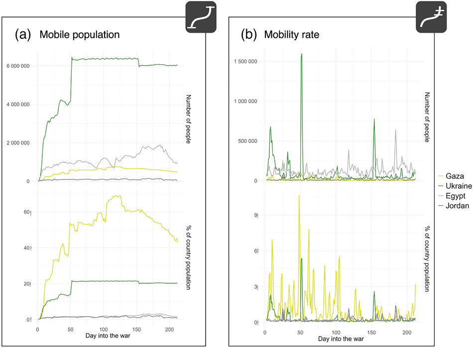
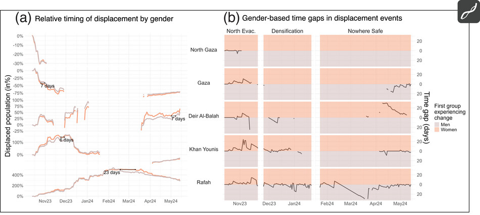

 
A new study by Oxford researchers from the <a href="https://demography.ox.ac.uk" target="_blank">Leverhulme Centre for Demographic Science (LCDS)</a>, Edith Darin, Ridhi Kashyap, and Douglas Leasure, introduces a novel approach to tracking population movements in conflict zones, offering a near real-time view of forced displacement in the Gaza Strip. The research, published in *Population and Development Review*, leverages high-frequency digital data to provide one of the most detailed accounts of population dynamics during the first six months of the Israel–Hamas war.

### A Crisis Analytics Toolbox

The study presents a "crisis analytics toolbox" that combines data from Facebook's marketing API with demographic estimates, satellite imagery, conflict event data, and evacuation orders. This methodology allows for the high-frequency monitoring of population movements, a task that is nearly impossible with traditional data collection systems in a war zone.

The researchers estimate that at the peak of displacement, up to 70% of Gaza's population was internally displaced. When compared to other recent conflicts, the displacement in Gaza was found to be proportionally one of the largest and fastest in recent history. The study highlights that while the war in Ukraine resulted in a larger absolute number of displaced people, the displacement in Gaza was three times larger, eight times faster, and five times more sustained relative to its population size.

### Gendered Patterns and Phased Responses

The research also uncovers significant gendered patterns in displacement. In the initial, more uncertain phases of the conflict, women were more likely to move before men. These patterns shifted as the conflict evolved and "safe zones" diminished, revealing how risk calculations change under growing duress.

The study identifies distinct phases in population movement:

1.  An **anticipatory response** in the early weeks, with people moving ahead of imminent danger.
2.  A **reactive phase** as violence and military operations intensified.
3.  A gradual **tapering off** as displacement became a prolonged reality and uncertainty about safe locations grew.

This granular temporal analysis, made possible by the use of digital trace data, provides critical insights for humanitarian organizations. The findings have been used by UNRWA and OCHA to inform their humanitarian response and contribute to the documentation of events on the ground.

As lead author Edith Darin states, "Our work shows how digital trace data can help provide timely demographic insights even during active conflict. By combining social media data with satellite imagery and conflict event data, we can better understand not only how many people are displaced, but also how displacement evolves through time, space, and across different population groups."

### Reference

Darin, E., Kashyap, R., & Leasure, D. R. (2026). Leveraging High-Frequency Digital Data to Analyze Forced Displacement Dynamics: A Case Study from the Gaza Strip. *Population and Development Review*. <a href="https://doi.org/10.1111/padr.70064" target="_blank">https://doi.org/10.1111/padr.70064</a>
