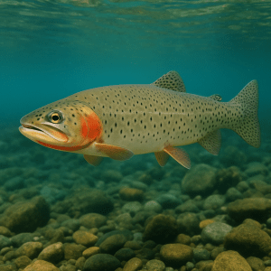

::: {.page-shell}

::: {.project-grid .research-grid}

<!-- Gaza displacement study PDR -->
::: {.project-card .research-paper}

::: {.project-body}
### New study uses digital data to monitor unprecedented displacement in Gaza in near real time
A new study by Oxford researchers from the Leverhulme Centre for Demographic Science (LCDS), Edith Darin, Ridhi Kashyap, and Douglas Leasure, introduces a novel approach to tracking population movements in conflict zones, offering a near real-time view of forced displacement in the Gaza Strip. The research, published in *Population and Development Review*, leverages high-frequency digital data to provide one of the most detailed accounts of population dynamics during the first six months of the Israel–Hamas war.

::: {.research-citation}
Darin, E., Kashyap, R., & Leasure, D. R. (2026). Leveraging High-Frequency Digital Data to Analyze Forced Displacement Dynamics: A Case Study from the Gaza Strip. *Population and Development Review*. https://doi.org/10.1111/padr.70064
:::

[Read the paper](https://doi.org/10.1111/padr.70064){.button-secondary target="_blank"}
:::
:::

<!-- Ukraine displacement study PDR -->
::: {.project-card .research-paper}
{fig-alt="Ukraine protest sign"}

::: {.project-body}
### Nowcasting daily population displacement in Ukraine through social media advertising data
In collaboration with the UN International Organization for Migration (IOM), this paper developed a method to estimate populations in near real-time for humanitarian response in Ukraine when other data sources were not available.

::: {.research-citation}
Leasure DR, Kashyap R, Rampazzo F, Dooley CA, Elbers B, Bondarenko M, et al. 2023. *Population and Development Review*, 49:231-254. doi:10.1111/padr.12558
:::

[Check out the paper](https://doi.org/10.1111/padr.12558){.button-secondary target="_blank"}
:::
:::

<!-- DRC population estimation Nature Comms -->
::: {.project-card .research-paper}
{fig-alt="DRC street scene"}

::: {.project-body}
### High-resolution population mapping from sparse survey data and building footprints in DRC
By linking household surveys to high-resolution building footprints derived from recent satellite imagery, this project estimated population sizes by age and sex for every 100-m grid cell in the Democratic Republic of Congo.

::: {.research-citation}
Boo G, Darin E, Leasure DR, Dooley CA, Chamberlain HR, et al. 2022. *Nature Communications*, 13(1):1330. doi:10.1038/s41467-022-29094-x
:::

[Learn all about it](https://doi.org/10.1038/s41467-022-29094-x){.button-secondary target="_blank"}
:::
:::

<!-- Colombia social cartography: Population Studies -->
::: {.project-card .research-paper}
{fig-alt="Workshop participants"}

::: {.project-body}
### Mapping hard-to-reach communities in Colombia by linking high-tech satellite data with low-tech community workshops
Working with DANE, we developed a method linking satellite remote sensing of buildings with information from community workshops and partial census data to strengthen representation of difficult-to-access communities.

::: {.research-citation}
Sanchez-Cespedes LM, Leasure DR, Tejedor-Garavito N, et al. 2024. *Population Studies*, 78(1):3-20. doi:10.1080/00324728.2023.2190151
:::

[Learn how it's done](https://doi.org/10.1080/00324728.2023.2190151){.button-secondary target="_blank"}
:::
:::

::: {.project-card .research-paper}
{fig-alt="Friends outdoors"}

<!-- Nigeria population mapping PNAS -->
::: {.project-body}
### National population mapping from sparse survey data in Nigeria while accounting for uncertainty
This paper developed a Bayesian statistical method to provide up-to-date population estimates for every 100-m grid cell across Nigeria, where census timing and quality created major data gaps.

::: {.research-citation}
Leasure DR, Jochem WC, Weber EM, Seaman V, Tatem AJ. 2020. *Proceedings of the National Academy of Sciences*, 117(39):24173-24179. doi:10.1073/pnas.1913050117
:::

[Read more](https://doi.org/10.1073/pnas.1913050117){.button-secondary target="_blank"}
:::
:::

::: {.project-card .research-paper}
{fig-alt="Aerial city buildings"}

::: {.project-body}
### Classifying settlement types from multi-scale spatial patterns of building footprints
This paper introduced a method to identify and map settlement types from building patterns observed via satellite remote sensing, supporting urban analytics and planning applications.

::: {.research-citation}
Jochem WC, Leasure DR, Pannell O, Chamberlain HR, Jones P, Tatem AJ. 2021. *Environment and Planning B*, 48(5):1161-1179. doi:10.1177/2399808320921208
:::

[Peruse the paper](https://doi.org/10.1177/2399808320921208){.button-secondary target="_blank"}
:::
:::

<!-- Trout population forecasting Ecology -->
::: {.project-card .research-paper}
{fig-alt="Fish illustration"}

::: {.project-body}
### Forecasting trout populations using satellite remote sensing to assess extinction risk
This paper developed a Bayesian population forecasting approach using remotely-sensed habitat and climate characteristics to estimate extinction risk for isolated Lahontan cutthroat trout populations.

::: {.research-citation}
Leasure DR, Wenger SJ, Chelgren ND, et al. 2019. *Ecology*, 100(1):e02538. doi:10.1002/ecy.2538
:::

[Dive into the details](https://doi.org/10.1002/ecy.2538){.button-secondary target="_blank"}
:::
:::
:::
:::
